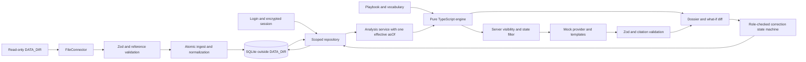

# Trustworx architecture

AI reads and writes, code judges.

One Next.js process, a local SQLite database, and a read-only file connector.
The pure engine consumes scoped repository inputs; it never queries the database.

The supplied v1 dataset lives in `data/` and is validated before transactional
ingestion into SQLite. `research/` holds supporting material outside the ingestion
path; `tests/answer_key.json` records expected findings for manual review.
Installation and conversion notes live in `docs/data/`. Ingestion preserves
accounts, decisions, case status events, and the LLM cache.

An opt-in `LOCAL_DEMO_LOGIN=true` development preview accepts username/password
`1`/`1` through the normal login endpoint and encrypted session. The repository
resolves this identity only in development while the flag is enabled, and grants
it no clients, sources, experts or precedents. No dataset or user row is created.
Production ignores the flag and rejects preview identities, including old sessions.

Implementation follows the nine phases in CODEX_PROMPT_01.md with the approved revisions.
Node 24 is the local runtime. The database adapter isolates the SQLite driver.

Phase 1 verification: better-sqlite3 installed successfully on Windows with Node
24.13.0. Prepared statements, commit and rollback passed. No fallback was needed.
node:sqlite was also smoke-tested successfully as the approved fallback.

The Trustworx colour tokens have one source of truth in `src/app/globals.css`.
Tailwind v4 maps these CSS variables through `@theme inline` in the same file;
the default colour palette is disabled. Component styles share these variables.
Paper/card/line/ink/muted provide neutral surfaces, borders, and text; indigo
identifies interactions. Only state badges use state colours, and only source
quote marks use highlighter. Control boundaries use muted rather than the
decorative line token to meet AA non-text contrast.

The root layout loads IBM Plex Sans 400/500, Serif 400 normal/italic, and Mono 400
with `next/font/google` (latin and latin-ext). Its generated font variables map
to the public `--font-sans`, `--font-serif`, and `--font-mono` Tailwind tokens in
`globals.css`. Sans is the UI default; Serif is scoped to the evidence drawer's
source body, with italic highlighted quotations; Mono identifies case, source,
and person IDs. Only weights 400/500 are used, with synthetic styles disabled.
Body text stays at 14–16px and headings at 16–20px. Tabular numerals are inherited
throughout the UI and explicitly applied to tables. Google font files are fetched
at build time and served locally at runtime.

`src/ui/Logo.tsx` shares the supplied `public/trustworx.svg` wordmark across the
sign-in screen, case inbox, and dossier header. The SVG is served as an image
with Trustworx alt text; its original artwork and aspect ratio are preserved.

## Data flow and boundaries

The connector interface returns raw entities and per-file issues. FileConnector
reads JSON and Markdown/YAML without writing to the input directory. A later
connector can implement the same interface. Structured record facts and declared
document assertions become stable evidence IDs with exact field/quote locators;
paragraph/heading fragments retain body offsets. There is no AI extraction.

`server/db.ts` is the SQLite driver boundary. Migrations run at startup; ingest
uses one transaction and prepared statements. The import pipeline is the only
exception to repository data access. Request handlers and server components use
`Repository` with a freshly resolved user. Out-of-scope IDs return 404. Foreign
precedents expose only an anonymised projection; unsafe summaries are suppressed.
Operational tables deliberately survive ingest so removed people invalidate
access without destroying decisions or account history.

The engine evaluates applicability, per-question authority, independence,
finding states, comparisons, derivations, procedures, gaps, precedents and
experts. It has no I/O or clock. Ranking numbers are internal and never returned.
`DEMO_NOW`, when set, is passed to both baseline and what-if analyses; otherwise
the service captures the clock once. URL exclusions only affect computation.

Mock drafting implements `LLMProvider`; tasks validate the entire output and
every citation, then fall back to deterministic templates on invalid output.
Client replies receive only shareable evidence with safe finding states. There
are no SDK requests, tokens, real-provider stubs, extraction, search or embeddings.

Correction state is `none → proposed → approved → executed → confirmed`.
Consultants and payroll leads may propose, execute and confirm. Approval requires
a payroll lead whose person ID differs from the proposer, including when one
person owns multiple logins. The actor comes from the session and the time from
the real server clock. The transaction uses an immediate lock to serialize
competing transitions. Explanations and confirmations are recorded separately.

## Security and operation

Sessions expire after eight hours, use httpOnly/sameSite=lax cookies, and are
secure in production. Login has bounded in-memory throttling; mutation routes
check Origin and bounded JSON bodies. Responses are not cached. Source and AI
text render as escaped React text; Markdown is deliberately displayed literally
with exact quotes highlighted, avoiding a new renderer dependency.

`next.config.ts` supplies common security headers and a restrictive default CSP.
`src/proxy.ts` replaces the HTML policy with a fresh nonce for framework scripts
and styles. Production has no unsafe-inline or unsafe-eval; development permits
the latter for Next tooling. All pages render dynamically. Proxy is not an
authorization boundary. Instrumentation validates configuration and migrates
SQLite before handling requests; invalid configuration exits the process.

The service needs the repository root as its working directory, the SQL migration
files, and persistent disk. Use one process per database. Builds do not require
session credentials; runtime does. Fonts are downloaded at build time and served
locally. The mock runtime works without network access.

## Approved clarifications and remaining scope

- App Router replaced the Hello World scaffold at the repository root.
- Node 24.13+ supplies native TypeScript support for CLI scripts; better-sqlite3
  passed on Windows, so the approved node:sqlite fallback was not selected.
- Unassigned open cases produce warnings; partial reported amounts remain valid
  as in the supplied templates. Cyclic source lineage is rejected explicitly.
- Unknown, mismatched and non-login roles have no access. The separately requested
  development preview is the explicit empty-scope exception.
- Real AI integration and deployment are out of scope. Connect Aikido after the
  milestone for the baseline/rescan workflow; no external audit was run here.
